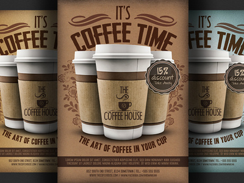

# Analysis of Coffee Shop Trans in 3 location

## Introduction/Project Overview
The primary objective of this project is to analyze the transaction data from three coffee shops located in Lower Manhattan Astoria and Hell's Kitchen. By examining this data, we aim to identify trends in customer purchases, popular products, pricing strategies, and the overall sales performance of each store. This analysis will provide valuable insights into customer preferences and help inform future business strategies to enhance customer satisfaction and drive sales growth.
## Data source
Coffee Shop Sales raw file.xlsx: This dataset used for this analysis contains detailed transaction records from a coffee shop, including transaction IDs, dates, times, quantities, store locations, product IDs, unit prices, product categories, product types, and product details. The data covers transactions from multiple store locations from January to June 2023. The dataset was provided as an excel file by the company
## Problem Statement
- Problem Statement
- Total Sales by Product Category: Summarizing total sales for each product category.
- Total Revenue by Store Location: Calculating the total revenue generated by each store location.
- Sales Trends Over Time: Analyzing sales data over time to identify trends.
### Tools 
- Excel(Data Cleaning and transformation) [Download Excel Here](https://microsoft.com)
- Powerbi(Analysis and Report)
### Skills Demonstrated
Data Cleaning/Transformation
1.	Added a column for Revenue using the operator 	=D2*H2
2.	Added a column for month using 			=MONTH(B2)
3.	Added a column for monthName using 		=TEXT(B2,"mmm")
4.	Added a column for weekday using 			=WEEKDAY(B2,2)
5.	Added a column for weekdasyName using 		=TEXT(B2,"ddd") 
6.	Added a column for Hour using 			=HOUR(C2)

•	Cleaned Data Sheet: Create a new sheet labeled "Cleaned Data" where the cleaned data is stored.
## Data Anaysis

1. Total Revenue per Month
•	Rows: Month
•	Values: Sum of unit_price * transaction_qty
•	This analysis will show the total Revenue revenue generated in each Month.
2. Total Transaction per Day of Week
•	Rows: weekdayName
•	Values: Count of Transaction_id
•	This analysis will show the count of transactions each week day.
3. Total Transaction by hour of Day
•	Rows: Hour
•	Values: Count of Transaction_id
•	This analysis will show the count of transactions each week day.
4. Total Transaction per product category
•	Rows: product_category
•	Values: Count of Transaction_id
•	This analysis will show the count of transactions per product_category sorted descending by transaction
5. Number of transactions and revenue by product_type sorted in descending order and filtered to the top 15(by transaction)
•	Rows: product_type
•	Values: Count of Transaction_id, Sum of Revenue
•	This analysis will show the count of transactions and Sum of Revenue per product_type sorted descending by transactio
[Coffee_Shop_Sales_dashboard.xlsx](https://github.com/user-attachments/files/20709621/Coffee_Shop_Sales_dashboard.xlsx)

## Results/Conclusion
Summary of Analysis of Coffee Shop Transactions
The analysis of the coffee shop transactions dataset using pivot tables revealed several key insights into sales performance, customer preferences, and product popularity across the three store locations Here are the main findings:

